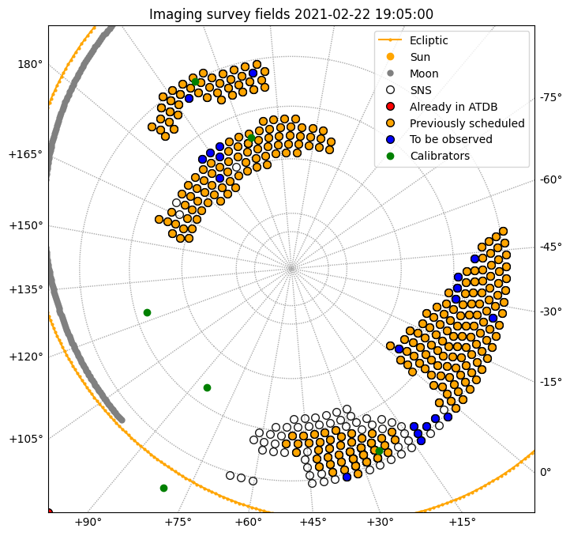

# apersched
Creates an observing schedule for Apertif imaging or timing surveys.

The programs read in a list of possible pointings.  It then calls the module atdbquery to query the ATDB for previously completed observations and removes them from the list of possible pointings.  The program then generates an observing schedule alternating between calibrators and target pointings for a user specified length of time.  The schedule is output as a csv file, and is also accompanied with a .png image which shows which fields have been selected (as well as those which were previously observed, or previously scheduled).


## Requirements:

The code requires Basemap to make the plots which might take some extra work to install: https://matplotlib.org/basemap/users/installing.html

Python dependencies can be installed with:
```
pip3 install -r requirements.txt
```

## Installation:

Fork to your own repository and do a git clone (nothing fancy).


## Usage:
```
$ python3 make_imaging_sched.py -h

usage: make_imaging_sched.py [-h] [-f FILENAME] [-p PREVIOUS_OBS] [-c] [-o OUTPUT] [-b] [-m MINS_PER_BEAM] [-s STARTTIME_UTC] [-l SCHEDULE_LENGTH] [-d SUN_DISTANCE] [-x] [-r] [-a] [-v]

Make observing schedule for the Apertif imaging surveys. Saves schedule in CSV file to be parsed by atdbspec. Outputs a png of the completed and scheduled pointings.

optional arguments:
  -h, --help            show this help message and exit
  -f FILENAME, --filename FILENAME
                        Specify the input file of pointings to choose from (default: ./ancillary_data/apertif_6mos2.03oct19.txt).
  -p PREVIOUS_OBS, --previous_obs PREVIOUS_OBS
                        Specify a file of previously scheduled pointings. (No default.)
  -c, --copy_previous   Copy file of previously scheduled pointings and append to it. (Default: False.)
  -o OUTPUT, --output OUTPUT
                        Specify the root of output csv and png files. If file exists, append to it (default: imaging_temp.csv).
  -b, --all_beam_calib  Default behavior is 15 minutes on a calibrator in the central beam. If option is included, run 40 beam calibration.
  -m MINS_PER_BEAM, --mins_per_beam MINS_PER_BEAM
                        Number of minutes for calibrator in 40b scan (default: 3.0).
  -s STARTTIME_UTC, --starttime_utc STARTTIME_UTC
                        The start time in ** UTC ** ! - format 'YYYY-MM-DD HH:MM:SS' (default: '2019-07-01 08:00:00').
  -l SCHEDULE_LENGTH, --schedule_length SCHEDULE_LENGTH
                        Number of days to schedule (can be float; default: 7.0).
  -d SUN_DISTANCE, --sun_distance SUN_DISTANCE
                        Minimum allowed distance in decimal degrees to Sun (default: 45.0).
  -x, --pol_cal_true    Force program to start with a polarization calibrator rather than flux calibrator.
  -r, --repeat_3ihv     If option is included, Try to schedule the 3*IHV field once this time. Works until it's been observed to MDS depth.
  -a, --check_atdb      If option is included, *DO NOT* check ATDB for previous observations.
  -v, --verbose         If option is included, print updated UTC times after each scan.
```

```
$ python3 make_timing_sched.py -h

usage: make_timing_sched.py [-h] [-f FILENAME] [-o OUTPUT] [-s STARTTIME_UTC] [-l SCHEDULE_LENGTH] [-a] [-p] [-d SUN_DISTANCE] [-m MIN_DEC]

Make observing schedule for the Apertif timing SC4. Saves schedule in CSV file to be parsed by atdbspec. Outputs a png of the completed and scheduled pointings.

optional arguments:
  -h, --help            show this help message and exit
  -f FILENAME, --filename FILENAME
                        Specify the input file of pointings to choose from (default: ./ancillary_data/all_pointings.v5.29apr19.txt).
  -o OUTPUT, --output OUTPUT
                        Specify the suffix of output csv and png files (default: timing_sched_temp).csv.
  -s STARTTIME_UTC, --starttime_utc STARTTIME_UTC
                        The start time in ** UTC ** ! - format 'YYYY-MM-DD HH:MM:SS' (default: '2019-03-11 08:00:00').
  -l SCHEDULE_LENGTH, --schedule_length SCHEDULE_LENGTH
                        Number of days to schedule (can be float; default: 2.0).
  -a, --check_atdb      If option is included, *DO NOT* check ATDB for previous observations.
  -p, --check_pulsars   If option is included, check for visible pulsars for each pointing
  -d SUN_DISTANCE, --sun_distance SUN_DISTANCE
                        Minimum allowed distance in decimal degrees to Sun (default: 30.0).
  -m MIN_DEC, --min_dec MIN_DEC
                        Minimum declination in decimal degrees used for survey pointings (default: 10.0).
```

Modified versions of the original code were used as the Apertif imaging surveys progressed to prioritize different sky areas and their preferred calibrator strategies:
* `make_imaging_hatlas.py` - Observe only medium-deep pointings in the H-ATLAS part of the sky.  Alternate flux and pol cal each time.
* `make_imaging_pponly.py` - Observe only medium-deep pointings in the Perseus-Pisces part of the sky. Visit both flux and pol cal between every observation.
* `make_imaging_priority.py` - Prioritize very select fields at the very end of survey operations.

## Output:
The program creates the following (samples below):
* a csv file formatted in the manner of an Apertif scheduling parameter file,
* a png file showing the previous and to-be-observed fields.

```
source,ra,ha,dec,date1,time1,date2,time2,int,type,weight,beam,switch_type,freqmode,centfreq,template
imaging_start,13:31:08.273,,+30:30:32.7031,2021-02-22,23:31:00,2021-02-22,23:33:00,10,S*,compound,0,system,300,1370,/opt/apertif/share/parsets/parset_start_observation_atdb_SubbandPhaseCorrection.template
3C286,13:31:08.273,,+30:30:32.7031,2021-02-22,23:35:00,2021-02-23,02:53:00,10,S*,compound,0,system,300,1370,/opt/apertif/share/parsets/parset_start_observation_atdb_SubbandPhaseCorrection.template
S2107+3848,21:07:35,,+38:48:32,2021-02-23,04:31:00,2021-02-23,16:01:00,30,T,compound,0,-,300,1370,/opt/apertif/share/parsets/parset_start_observation_atdb_SubbandPhaseCorrection.template
3C147,05:42:36.1349,,+49:51:07.2047,2021-02-23,16:10:15,2021-02-23,19:28:15,10,S*,compound,0,system,300,1370,/opt/apertif/share/parsets/parset_start_observation_atdb_SubbandPhaseCorrection.template
S1242+5058,12:42:48,,+50:58:09,2021-02-23,20:02:15,2021-02-24,07:32:15,30,T,compound,0,-,300,1370,/opt/apertif/share/parsets/parset_start_observation_atdb_SubbandPhaseCorrection.template
S0014+2904,00:14:15,,+29:04:49,2021-02-24,07:43:57,2021-02-24,19:13:57,30,T,compound,0,-,300,1370,/opt/apertif/share/parsets/parset_start_observation_atdb_SubbandPhaseCorrection.template
3C286,13:31:08.273,,+30:30:32.7031,2021-02-24,23:27:57,2021-02-25,02:45:57,10,S*,compound,0,system,300,1370,/opt/apertif/share/parsets/parset_start_observation_atdb_SubbandPhaseCorrection.template
M2214+3130,22:14:46,,+31:30:45,2021-02-25,05:29:57,2021-02-25,16:59:57,30,T,compound,0,-,300,1370,/opt/apertif/share/parsets/parset_start_observation_atdb_SubbandPhaseCorrection.template
3C147,05:42:36.1349,,+49:51:07.2047,2021-02-25,17:08:16,2021-02-25,20:26:16,10,S*,compound,0,system,300,1370,/opt/apertif/share/parsets/parset_start_observation_atdb_SubbandPhaseCorrection.template
M1315+3356,13:15:19,,+33:56:40,2021-02-25,20:34:39,2021-02-26,08:04:39,30,T,compound,0,-,300,1370,/opt/apertif/share/parsets/parset_start_observation_atdb_SubbandPhaseCorrection.template
S0052+2904,00:52:09,,+29:04:49,2021-02-26,08:16:25,2021-02-26,19:46:25,30,T,compound,0,-,300,1370,/opt/apertif/share/parsets/parset_start_observation_atdb_SubbandPhaseCorrection.template
3C286,13:31:08.273,,+30:30:32.7031,2021-02-26,23:20:25,2021-02-27,02:38:25,10,S*,compound,0,system,300,1370,/opt/apertif/share/parsets/parset_start_observation_atdb_SubbandPhaseCorrection.template
...
S2346+5324,23:46:41,,+53:24:05,2021-03-07,06:22:22,2021-03-07,17:52:22,30,T,compound,0,-,300,1370,/opt/apertif/share/parsets/parset_start_observation_atdb_SubbandPhaseCorrection.template
3C147,05:42:36.1349,,+49:51:07.2047,2021-03-07,17:59:24,2021-03-07,21:17:24,10,S*,compound,0,system,300,1370,/opt/apertif/share/parsets/parset_start_observation_atdb_SubbandPhaseCorrection.template
S1435+3356,14:35:19,,+33:56:40,2021-03-07,21:26:53,2021-03-08,08:56:53,30,T,compound,0,-,300,1370,/opt/apertif/share/parsets/parset_start_observation_atdb_SubbandPhaseCorrection.template
S0220+2904,02:20:34,,+29:04:49,2021-03-08,09:08:46,2021-03-08,20:38:46,30,T,compound,0,-,300,1370,/opt/apertif/share/parsets/parset_start_observation_atdb_SubbandPhaseCorrection.template
3C286,13:31:08.273,,+30:30:32.7031,2021-03-08,22:40:46,2021-03-09,01:58:46,10,S*,compound,0,system,300,1370,/opt/apertif/share/parsets/parset_start_observation_atdb_SubbandPhaseCorrection.template
imaging_end,13:31:08.273,,+30:30:32.7031,2021-03-09,02:00:46,2021-03-09,02:01:46,10,T,compound,0,-,300,1370,/opt/apertif/share/parsets/parset_start_observation_atdb_SubbandPhaseCorrection.template
```



## Notes
Run with -h to see the list of options.  Recommended first time operation:
```
python3 make_imaging_sched.py -a -b -o test_run
```

If you have no way to connect to ATDB, always run with the -a option.

For imaging, one may wish to change the input field list to only a list of the "first year" positions.  Default is all possible imaging positions, however, a portion of the code bounded by `##` indicates where the user can hardcode a selection.  Current version of the code includes some examples of specific field selections for week 2 of science verification, including focusing on (1) PP for MDS fields or (2) CVn for MDS fields.  These need to be uncommented out to be used.

## Behavior

For imaging, the program selects the lowest Dec field available, however if the Sun is closer to a target field than a user specified amount, the program selects the highest Dec field available.  At least in the beginning of the survey period, in most cases, this will give at least 20 more degrees separation.  If the Sun is within the user specified distance of a calibrator, the program will print a WARNING, but it will still schedule the calibrator.

A Sun and Moon avoidance strategy has also been implemented for the timing surveys (moon is never above ~+23d).  The minimum Sun distance can be set by the user.  The Moon distance is 0.5 degrees.  (This should be increased & hardcoded to the FoV of the tied array beams).  At the moment, the program prints a warning if a pulsar calibrator is within the minimum Sun or Moon distance, but takes no other action.

### Known plotting 'feature'

For imaging, if the RA range of targets is so restricted that it takes more than 6 hours to wait for a target source to rise, then the output png plot includes the position of 3C147 and/or 3C138, however the schedule is still correct.  It's just a funky plotting thing which can be ignored.  This is rare and is only seen when the RA range in one part of the sky is less than a couple hours.

## Version history

* apersched v1.0.0
  * Released TBD 2022
  
## Authors
Kelley M. Hess, Helga Dénes, Leon Oostrum, and Betsey Adams

## Reference
* Zenodo link (TBD)
* Hess et al (in prep) - Apertif survey description paper. 

## Copyright and license

© 2022 Kelley M. Hess

This programme is free software: you can redistribute it and/or modify it 
under the terms of the GNU General Public License as published by the Free 
Software Foundation, either version 3 of the License, or (at your option) any 
later version.

This programme is distributed in the hope that it will be useful, but **without 
any warranty**; without even the implied warranty of **merchantability** or **fitness 
for a particular purpose**. See the GNU General Public License for more details.

You should have received a copy of the GNU General Public License along with 
this programme. If not, see http://www.gnu.org/licenses/.
